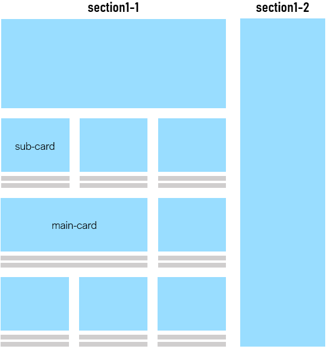

# Donga News Site
Reconstructed the existing [Donga news website](!https://www.donga.com/) layout. The major changes are as follows.
+ __Grid Layout__ : Grid layout clarifies the distinction between sections and enhances contents readability.
+ __Card News__ : Through the form of a card, the picture and title of the article are easily recognized.
+ __Slick Slider__ : A slick slider was implemented using vanilla js.

<div style="text-align:center">
  
</div>

## Detail ##
### 1. Grid Layout
The overall content layout consists of grids. Section1 is divided into section1-1 and section1-2 in a 3:1 ratio. A user can easily make out those card news section(section1-1) and the side news section(section1-2) with a space between them.

<p style="align: center;width: 100%;">
  
</p>

Likewise, the card news section has grid layout with 3 columns. Each news card can occupy one or two columns. The important news cards are large by taking up two columns.

### 2. Card News
A card is composed of a big picture and a news title. Users can see and find news they want at a glance.


### 3. Slick Slider
A __`slideToShow`__ parameter decides the number of slides to be shown on the screen.
```js
new Slick("#section2", 4); // The slideToShow value is 4
```

 Also, the resize() function re-calculates the slide width as window width changes.
 ```js
 // slick.js constructor()
 window.addEventListener('resize', this.resize.bind(this), false);
 ```

## Source
Pictures and Phrases used in the project are from [donga.com](!https://www.donga.com/).
